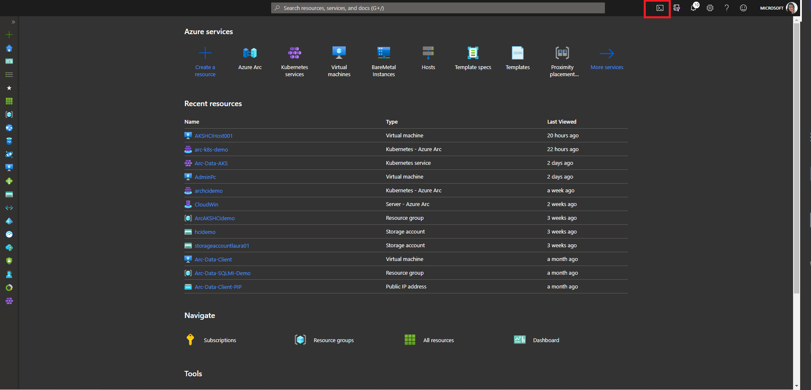

# Challenge 01 - Getting Started

In this challenge, you will connect to the [Azure Cloud Shell](https://azure.microsoft.com/features/cloud-shell/) that will be needed for future challenges.

Cloud Shell is a free (excl. storage cost) service which provides you a virtual server in a container, including pre-installed Azure CLI.

In this challenge, you will:

- Login to the Azure Portal
- Verify `az` installation
- Verify `bicep` installation
- Create a folder structure to complete challenges

> **Note:** If you would rather complete the challenges from you local worskstation and install the tooling, detailed instructions can be found [here](local.md).

## How to

### Login to the Azure Portal

Navigate to [https://portal.azure.com](https://portal.azure.com) and login with your Azure Credentials.

### Open the Cloud Shell

Located at the top of the page is the button open the Azure Cloud Shell inside the Azure Portal.



> **Note:** Another option is to use the full screen Azure Cloud Shell at [https://shell.azure.com/](https://shell.azure.com/).

The first time you connect to the Azure Cloud Shell you will be prompted to setup an Azure File Share that you will persist the environment.


Click the "Bash (Linux)" option.

Select the Azure Subscription and click "Create storage":


After a few seconds you should see that your storage account has been created and that you can access Cloud Shell:


> **Note:** Behind the scenes this is creating a new Resource Group with the name `cloud-shell-storage-westeurope` (or which ever region you defaulted to). If you need more information, it can be found [here](https://docs.microsoft.com/azure/cloud-shell/persisting-shell-storage).

SUCCESS!
You are now logged into the Azure Cloud Shell which uses your portal session to automatically authenticate you with the Azure CLI.

### Verify Utilities

In the Cloud Shell type the following commands and verify that the utilities are installed:

`az -v`

```shell
azure-cli                         2.21.0

core                              2.21.0
telemetry                          1.0.6

Extensions:
aks-preview                       0.4.72
connectedk8s                       0.2.7
k8sconfiguration                   0.1.8
ai-examples                        0.2.5
ssh                                0.1.4

Python location '/opt/az/bin/python3'
Extensions directory '/home/laura/.azure/cliextensions'
Extensions system directory '/opt/az/lib/python3.6/site-packages/azure-cli-extensions'

Python (Linux) 3.6.10 (default, Mar 19 2021, 05:58:36)
[GCC 8.3.0]

Legal docs and information: aka.ms/AzureCliLegal


Your CLI is up-to-date.

Please let us know how we are doing: https://aka.ms/azureclihats
and let us know if you're interested in trying out our newest features: https://aka.ms/CLIUXstudy
```

`bicep -v`

```shell
$ bicep -v
Bicep CLI version 0.3.1 (d0f5c9b164)
```

## Verify Subscription

Run the command `az account list -o table`.

```sh
az account list -o table
Name                             CloudName    SubscriptionId                        State    IsDefault
-------------------------------  -----------  ------------------------------------  -------  -----------
Visual Studio Premium with MSDN  AzureCloud   xxxxxxxxxx-xxxx-xxxx-xxxx-xxxxxxxxxx  Enabled  True
Another sub1                     AzureCloud   xxxxxxxxxx-xxxx-xxxx-xxxx-xxxxxxxxxx  Enabled  False
Another sub2                     AzureCloud   xxxxxxxxxx-xxxx-xxxx-xxxx-xxxxxxxxxx  Enabled  False
Another sub3                     AzureCloud   xxxxxxxxxx-xxxx-xxxx-xxxx-xxxxxxxxxx  Enabled  False
```

If you have more than subscription, make sure that subscription is set as default using the subscription name (use the one that matches your environment):

```shell
az account set -s 'Visual Studio Premium with MSDN'
```

## Create Challenge Scaffolding

To make things easy for the challenges, let's create a folder structure to hold the code configuration we will create.

Make sure you are in the home directory:

```shell
cd ~/
```

Run the following in the Azure Cloud Shell, this will simply create a folder structure for you to place your ARM templates and any code required:

```shell
mkdir AzureWorkChallenges && cd AzureWorkChallenges && mkdir challenge01 && mkdir challenge02 && mkdir challenge03 && mkdir challenge04 && mkdir challenge05 && mkdir challenge06 && mkdir challenge07
```

What you should end up with is a structure like this:

```shell
AzureWorkChallenges
|- challenge01
|- challenge02
|- challenge03
|- challenge04
|- challenge05
|- challenge06
|- challenge07
```

## Github Access

If you already have a github account you can skip this step.

Github repositories will be needed to complete some of the later challenges as well as creating the DevOps pipelines.

Sign up for a free github.com account by going to [https://github.com/join](https://github.com/join) and following the instructions.

Once created, login.

## What's next?

Once this section is completed, go back to [the agenda](../../README.md)
